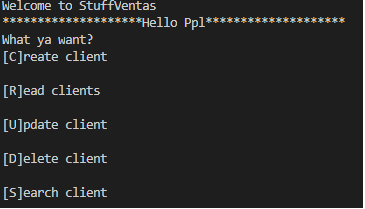
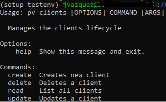

# [C][R][U][D] Clients 
This will create and system in which you'll be able to Create a DataBase, Read from it and Update it with a focus in Python. This Will have a incremental improvement with the objective of havind robustness and learn the development life cycle.

## V.1

* [C] Creates a new entry to the DB, this is just a dictionary within a list
* [R] Reads from whatever is stored in the list "Clients" givin it a readable format 
* [U] Search by name and updating such name
* [D] Delete client by name

## V.2
This version uses a command line interface and is setup in a linux OS using pip. Has the same functionality as main.py but refactored to a modular form. Uses the click library for the interface

